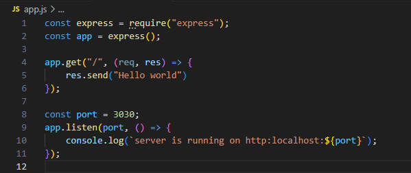

# EXPRESS JS
  
  
### Introduction.
<p>Express.js is a back end web application framework that is used to build restful APIs with Node js . It is designed for building web applications and APIs. It is a standard server framework for Node js. 
It is a small framework that works on top of Node.js web server functionality to simplify its APIs and add helpful new features.</p>
  
### Prerequisite.
- <P> Download any code editor e.g VS code. Visual Studio code which is a code editor with support for development operations like debugging, task running, and version control. Go to https://code.visualstudio.com </P>
  

  
- Download and install the  Node.js application, which is the environment in which express.js will run. Got to https://node.js.org
  
  

  
#### STEP 1: Create a folder in a terminal.
Once Node.js is installed NPM(Node Package Manager) is also installed. Create a Folder in the terminal.
  
```
mkdir express_js
```
```
cd express_js
```
#### STEP 2: Create  a file 
We need to create a file and name it app.js.
```
touch app.js
```
  
#### STEP 3: Install the NPM.
Now, we install the Npm (Node Package Manager) in the terminal  using the command below;
```
npm init -y
```
  
<mark>_PS:The image below explains the creation of folder,creation of file, installation of npm(node package manager)._ </mark>

  
```
"code ." (This command is used to open the folder in your coding environment).
```
  
<mark>_**NOTE:** The “npm init” command will initialize a project and create the package.json file._</mark>
  
 #### STEP 4: Install Express.js,Nodemon and Morgan 
In other to use express.js in the file, express.js has been pre-installed while installing the node.js. To install Express.js use the command below in the terminal.
```
npm install express
```
The nodemon npm Module is a module that develop node.js based applications by automatically restarting the node application when file changes in the directory are detected. Nodemon is a Dev Dependency module.
Installing Nodemon is similar to installing express.js, Nodemon has been pre-installed while installing the node.js. To install Nodemon us the command below in the terminal.
```
npm install nodemon --save-dev
```
Morgan is another HTTP request logger middleware for Node. js. It simplifies the process of logging requests to your application.
Also, the morgan dependency has been pre-installed while installing node.js. To install Morgan use the command below in the terminal.
```
npm install morgan
```
  
  
#### STEP 5: Import Express.js 
Import the express file that was created in the package.json file into the app.js file using the javascript below;
  
```javascript
 const express = require("express");
 ```
  
#### STEP 6: Make an Express.js Function
The function defines the express as a function.
```javascript
const app = express ();
```
#### STEP 7: Create a Route 
The route helps to determine how an application responds to a client request to a particular endpoint, which is a URL (or path) and a specific HTTP request method (GET, POST, and so on).
Here, we want to send a message  to the server "Hello World"
```javascript
 app.get( "/", (req,res) => {
   res.send("Hello world")
  })
```
<mark>_**NOTE:** req means request, while res means response._</mark>
  
#### STEP 8: Create a Port Number
The creation of port number helps to specify the port on which we want our app to listen. The port number ranges from 0 - 65000. Now create a port number of your choice, but for this sake of this  we will be using "3030"
  
```javascript
const port = 3030;
```
#### STEP 9: Listen to your server 
Listening refers to the process where a server waits for incoming connections from clients.
  
```javascript
app.listen(port, ()=>{
console.log (`server is running on http:localhost:${port}`);
 });
 ```
 ```
**NOTE:** The local host = "127.0.0.1"
```

  
  
#### STEP 10: Run the code in your terminal.
Using the commands below you can run the code in your terminal.
```
node app.js
```

or 
```
npm start
```

<mark>_**NOTE:** “npm start” is a run command from your scripts located in your package.json file._</mark>
  
```
npm run dev
```

  
<mark>_**NOTE:** "npm run dev" is used to execute specific scripts defined in the package. json file, particularly those scripts related to the development environment setup._ </mark>
  
  
#### STEP 11: Launch the link in the browser.
Using the link that was generated launch it on any browser e.g goggle chrome, mozilla fire fox, opera, safari e.t.c.
  
```
http://localhost:3030
```
  

  
  
  
  